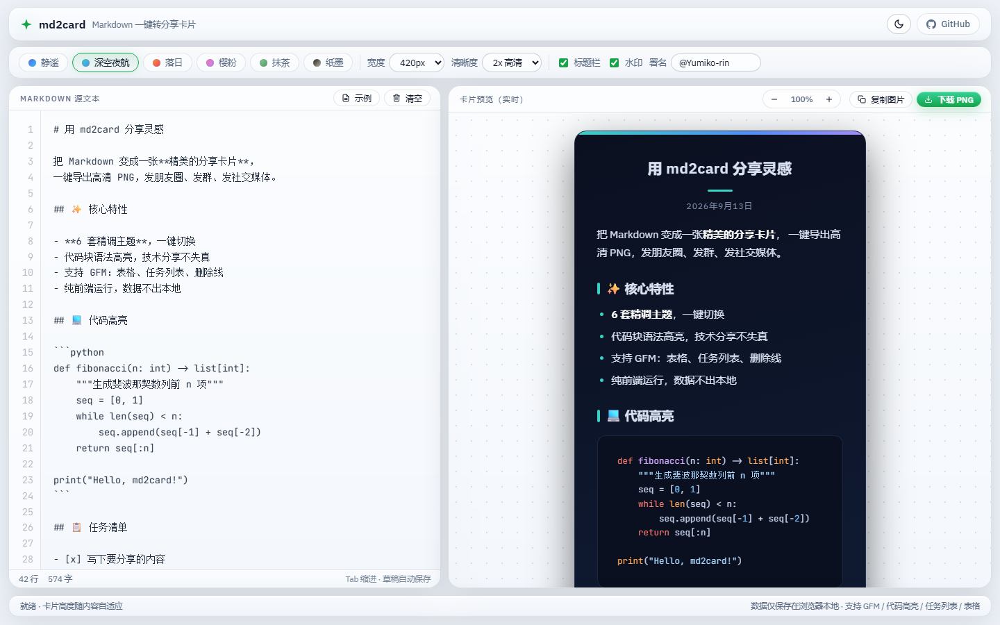
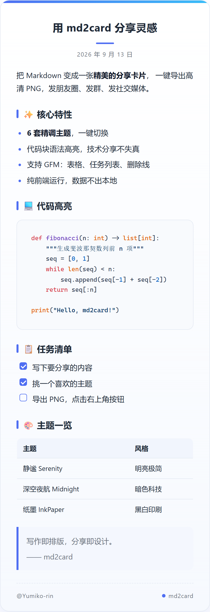
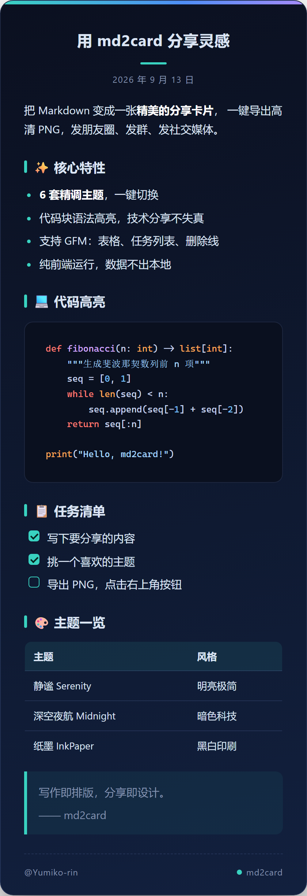
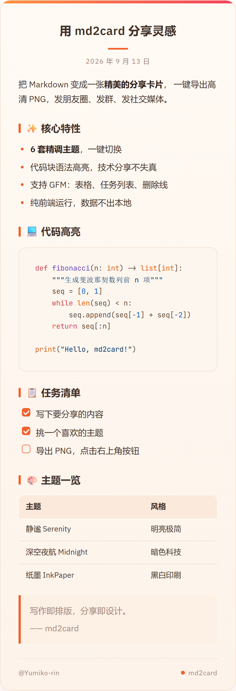
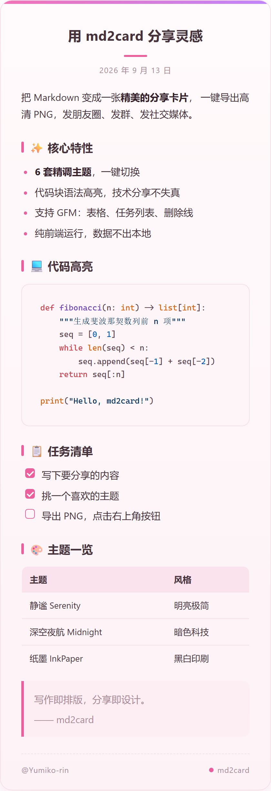
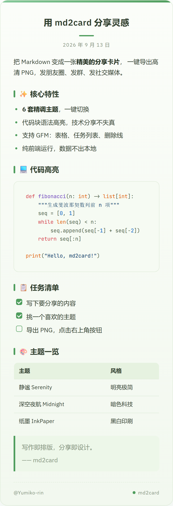
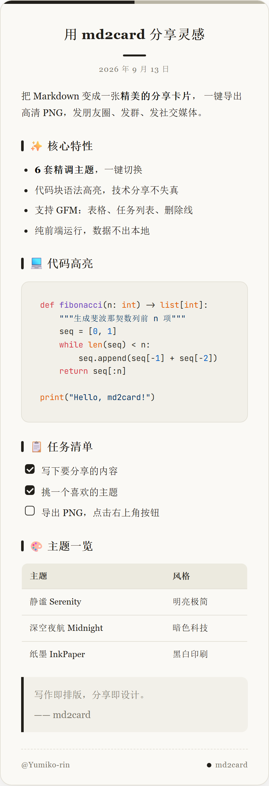

<div align="center">

# ✦ md2card

**Markdown 一键转精美分享卡片 · Turn Markdown into beautiful shareable cards**

粘贴 Markdown → 挑主题 → 导出高清 PNG。发朋友圈、发群、发社交媒体，从此不再截图。

**🔗 在线使用：[https://yumiko-rin.github.io/md2card/](https://yumiko-rin.github.io/md2card/)**

[](LICENSE)
[](web/)
[](cli/)
[](.github/workflows/pages.yml)

</div>

---

## 🖥️ 界面预览



## ✨ 特性

- 🎨 **6 套精调主题** — 静谧 / 深空夜航 / 落日 / 樱粉 / 抹茶 / 纸墨，一键切换
- 📝 **完整 Markdown 支持** — GFM 表格、任务列表、删除线，代码块语法高亮（180+ 语言）
- 🖼️ **高清导出** — 2x / 3x 像素密度，社交平台分享不糊
- 🔒 **数据不出本地** — 纯前端渲染，无后端、无埋点，草稿自动保存在浏览器
- 🖥️ **双形态交付** — Web 界面给小白，CLI 给程序员，共用同一套渲染模板，输出像素级一致
- 📦 **零安装即用** — Web 版打开即用（可部署 GitHub Pages），依赖全部本地化，离线可用

## 🎨 主题一览

| | |
|:---:|:---:|
|  |  |
| **静谧 Serenity** · 明亮极简 | **深空夜航 Midnight** · 暗色科技 |
|  |  |
| **落日 Sunset** · 暖色渐变 | **樱粉 Sakura** · 柔粉浪漫 |
|  |  |
| **抹茶 Matcha** · 清新草木 | **纸墨 InkPaper** · 黑白印刷 |

## 🚀 快速开始

### Web 版（推荐）

打开 [web/index.html](web/index.html) 即可使用，或访问在线版本（GitHub Pages）：

1. 左侧粘贴 Markdown
2. 顶部选主题、调宽度与清晰度
3. 点击「下载 PNG」或「复制图片」（快捷键 `Ctrl/⌘ + S`）

### CLI 版

适合批量转换与自动化流水线：

```bash
pip install -r cli/requirements.txt
playwright install chromium

# 单文件转换（输出 demo.png）
python cli/md2card.py examples/demo.md

# 指定主题 / 倍率 / 署名
python cli/md2card.py notes.md -o card.png --theme midnight --scale 3 --watermark "@Yumiko-rin"

# 批量转换目录下所有 .md
python cli/md2card.py notes/ -o out/

# 查看全部主题
python cli/md2card.py --list-themes
```

## 🏗️ 工作原理

```
┌─────────────┐   同一套模板与主题    ┌──────────────────┐
│  Web 前端    │ ──────────────────▶ │  html-to-image    │ ──▶ PNG（浏览器内）
│ (编辑+预览)  │   card.css          ├──────────────────┤
└─────────────┘   renderer.js      │  Playwright CLI   │ ──▶ PNG（无头浏览器）
                                   └──────────────────┘
```

- `web/card.css` — 卡片排版 + 全部主题（纯 CSS 变量，新增主题只需一段代码）
- `web/renderer.js` — Markdown 解析、代码高亮、标题提取等共享渲染逻辑
- `templates/card.html` — CLI 渲染模板，加载上述文件后由 Playwright 截图
- `cli/md2card.py` — 命令行入口，支持单文件 / 批量 / 自定义导出参数

## 🛠️ 自定义

**新增主题**：在 [web/card.css](web/card.css) 末尾复制任意 `.mdc-theme-*` 块，改 id 与变量，再在 [web/renderer.js](web/renderer.js) 的 `THEMES` 中注册即可，Web 与 CLI 同时生效。

**卡片规格**：宽度 360–480px，高度随内容自适应；顶部色带、标题栏、水印均可独立开关。

## 🗺️ Roadmap

- [ ] 长文自动切分为多张卡片
- [ ] 自定义主题色 / 背景图
- [ ] 链接转脚注样式
- [ ] VS Code 插件

## 🤝 贡献

欢迎 Issue 与 PR！提交前请运行 `python cli/md2card.py examples/demo.md` 确认渲染正常。

## 📄 许可证

[MIT](LICENSE) © 2026 Yumiko-rin

---

<div align="center">
<sub>如果这个项目对你有帮助，欢迎点一个 ⭐ Star</sub>
</div>
